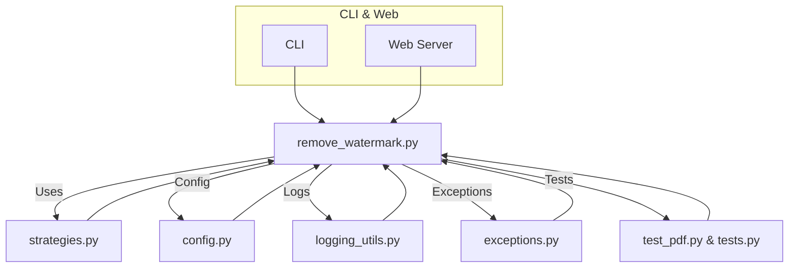

# PDF Watermark Remover - Refactoring Summary

## Overview

The PDF Watermark Remover project underwent two major refactoring phases, evolving from a simple script to a robust, modular, and professional-grade application. The first phase focused on improving core logic and modular design. The second phase enhanced functionality, configurability, error handling, and user experience.

---

## Refactoring Phases

| Phase | Key Improvements |
|-------|---------------------------------------------------------------------------------------------------------------------------------------|
| 1     | - Rewrote core watermark detection/removal logic<br>- Introduced strategy pattern for extensibility<br>- Modularized code for maintainability |
| 2     | - Added YAML config support<br>- Improved logging system<br>- Added progress reporting<br>- Enhanced error handling<br>- Added unit tests      |

---

## Architecture Diagram



---

## Major Enhancements Table

| Area                | Before Refactoring                  | After Refactoring                                 |
|---------------------|-------------------------------------|---------------------------------------------------|
| Core Logic          | Monolithic, hard to extend          | Modular, extensible via strategy pattern           |
| Configuration       | Hardcoded, minimal                  | YAML/env config, flexible                         |
| Logging             | Basic print/debug                   | Structured logging, log rotation                   |
| Error Handling      | Generic exceptions                  | Custom exception hierarchy                         |
| Progress Reporting  | Minimal                             | Detailed progress callback                         |
| Testing             | Few or no tests                     | Comprehensive unit tests                           |
| User Experience     | Basic CLI                           | CLI & Web, batch, parallel, verbose, backup, etc.  |

---

## Unified CLI/Server Logic (2025-05)

- The web server (`server.py`) and CLI (`cli.py`) now both use the same watermark removal logic, calling the shared `remove_watermark` function from `remove_watermark.py`.
- The server's `_process_pdf_file` method was refactored to invoke this logic directly, eliminating code duplication and ensuring consistent behavior between interfaces.
- All configuration handling and error reporting are now unified across both modes.
- This guarantees that any future improvements or bug fixes to watermark removal automatically benefit both CLI and server users.

---

## Example: Using as a Library

```python
import asyncio
from remove_watermark import remove_watermark, Config

config = Config("config.yaml")

def progress_callback(status, progress):
    print(f"\r{status}: {progress*100:.1f}%", end="")

async def process_pdf():
    input_file = "document.pdf"
    output_file = "document_no_watermark.pdf"
    success = await remove_watermark(
        input_file,
        output_file,
        progress_callback=progress_callback
    )
    print(f"\nWatermark removed: {success}")

asyncio.run(process_pdf())
```

---

## Recommendations for Future Improvements

1. Expand unit tests for higher coverage
2. Add integration tests for workflow validation
3. Implement more watermark detection/removal strategies
4. Optimize performance for large PDFs
5. Add internationalization (i18n) support
6. Improve web UI/UX
7. Automate deployment workflows
